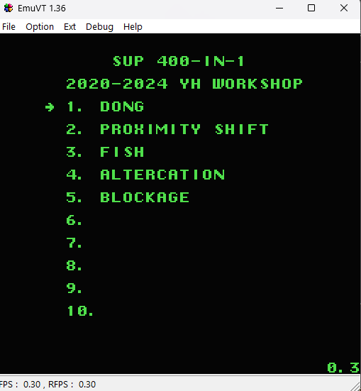

# CustomMenu_Sup400in1

## Note: Under construction!

Custom menu template for Sup 400-in-1 handhelds. Written in C and some 6502 assembly.

Requires ROM dump from the actual handheld.

For more information, read the [article](https://nyh-workshop.github.io/Custom-ROM-Sup-Game-Box-400in1/) to understand how to dump the ROM, and to modify it.

## Requirements:

CC65 - latest version will do.

## How to compile:

1. At the appList.c and appList.h, if you need to add your custom app inside, make sure you have the menu item properties, reset vector and app title ready inside.

For the appProperties, use the [OneBusCalc](https://github.com/nyh-workshop/OneBusCalc) to calculate the OneBus' registers for the PRG and CHR locations. Then copy the generated output into the appProperties_X array.

Example, if you have a "MyGame" here at slot no. X, you need to add in the appList.c:

```
// Menu Item Properties:
const unsigned char appProperties_X[] = {...};

// Reset vectors:
const unsigned char appRstVct_X[] = { 0x00, 0x80 };

// App titles:
const char appTitle_X[] = "MyGame";

```

2. In the Makefile, you need to add the .bin file of the "MyGame" before the '>'. If you have ROM dump that have bit swaps, you need to include this there too. Example:

```
	cat romdump_sup400in1_E7E0_init.bin output.bin > output_final.bin
	cat romdump_sup400in1_E7E0_init_swapBits45.bin output.bin > output_final_swapBits45.bin
```
Note: You may need to **rearrange** the CHR and PRG in the MyGame.bin file according to the OneBusCalc app provided. More improvements to automatically include nes files coming soon!

3. Enter "make" in the cmd. 

4. After building, use EmuVT 1.36 to run. If you are satisfied with the contents, you can copy this compilation "output_final.bin" into the 29GL flash using the T56 programmer.

This is an example menu:


